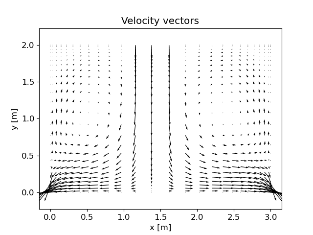
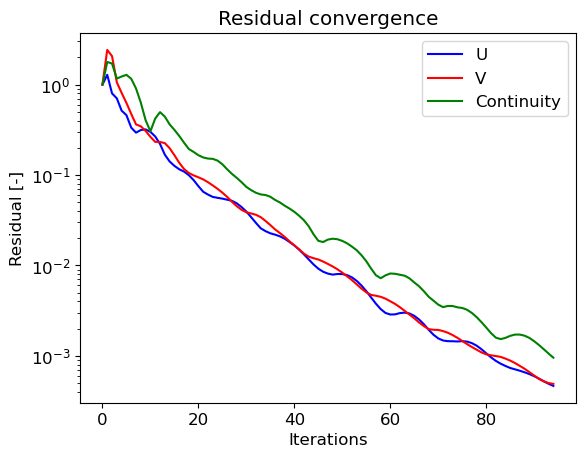

# 2D Navier-Stokes SIMPLE Solver

A Python implementation of the **SIMPLE** (Semi-Implicit Method for Pressure-Linked Equations) algorithm for solving 2D steady incompressible laminar flow on non-equidistant collocated grids.

---

## What this solves

Given a closed 2D domain with prescribed inlet velocities and outlet boundary conditions, this solver computes the steady-state velocity and pressure fields by iteratively coupling the discretised momentum equations with a pressure-correction step.

The governing equations are the incompressible Navier-Stokes equations:

```
∇·(ρu⊗u) = ∇·(μ∇u) − ∇p        (momentum)
∇·u = 0                            (continuity)
```

---

## Key features

| Feature | Options |
|---|---|
| Convection scheme | First-Order Upwind / Central Differencing (`FOU_CD`), Hybrid |
| Linear solver | Gauss-Seidel, TDMA (Thomas Algorithm) |
| Pressure-velocity coupling | SIMPLE with explicit under-relaxation |
| Face flux interpolation | No correction, equidistant Rhie-Chow, **non-equidistant Rhie-Chow** |
| Mesh support | Non-equidistant collocated grids |

The non-equidistant Rhie-Chow scheme with TDMA and Hybrid convection converges in **~80 iterations** vs ~175 for the baseline Gauss-Seidel + FOU_CD configuration — a 2.5× reduction in iteration count and 60% reduction in wall time.

---

## Results

| Configuration | Iterations | Wall time (s) |
|---|---|---|
| Gauss-Seidel + FOU_CD + noCorr | ~175 | 18.6 |
| Gauss-Seidel + FOU_CD + equiCorr | ~175 | 13.1 |
| Gauss-Seidel + FOU_CD + nonEquiCorr | ~175 | 12.6 |
| Gauss-Seidel + Hybrid + nonEquiCorr | ~175 | 10.6 |
| **TDMA + Hybrid + nonEquiCorr** | **~80** | **7.2** |

Velocity field at convergence (Case 13, coarse grid, μ = 0.001):



Residual convergence — TDMA Hybrid nonEquiCorr:



---

## Project structure

```
numerical-coupled-system-algorithm/
├── src/
│   ├── grid.py          # Mesh loader and geometric pre-computation
│   ├── solver.py        # SIMPLE algorithm (OOP)
│   └── postprocess.py   # Plotting utilities
├── scripts/
│   └── run_solver.py    # Entry point — edit CONFIG here
├── data/                # Grid files (not tracked — see setup below)
├── figures/             # Auto-generated plots (not tracked)
├── docs/
│   └── report.pdf       # Full derivation: discretisation, Rhie-Chow, SIMPLE
├── requirements.txt
└── .gitignore
```

---

## Setup

```bash
git clone https://github.com/abukar-hassan-dev/numerical-coupled-system-algorithm.git
cd numerical-coupled-system-algorithm

python -m venv .venv
source .venv/bin/activate        # Windows: .venv\Scripts\activate
pip install -r requirements.txt
```

Place the grid data files in `data/` following the structure:

```
data/
└── grid1/
    ├── coarse_grid/
    │   ├── xc.dat
    │   ├── yc.dat
    │   ├── u.dat
    │   └── v.dat
    └── fine_grid/
        └── ...
```

Then run:

```bash
python scripts/run_solver.py
```

All configuration (case ID, fluid properties, solver settings) lives in the `CONFIG` dictionary at the top of `run_solver.py`.

---

## Implementation notes

**Rhie-Chow interpolation** is applied to compute face velocities for the mass flux. Without it, the checkerboard pressure instability appears on collocated grids. The non-equidistant formulation correctly accounts for varying cell widths:

```
u_e = fxe·(u_E − (ΔxΔy/aP_E)·∇p_E) + (1−fxe)·(u_P − (ΔxΔy/aP)·∇p_P) − (ΔxΔy/aP_e)·∇p_e
```

**TDMA** solves the pressure-correction equation line-by-line using the Thomas algorithm, which is unconditionally stable for tridiagonal systems and significantly faster than point-by-point Gauss-Seidel for structured grids.

**Under-relaxation** is applied implicitly to the momentum equations (αᵤᵥ = 0.7) and explicitly to the pressure correction (αₚ = 0.3) to stabilise the iteration.

---

## Background

Developed by Abukar Hassan and Bastian Addicks at Chalmers University of Technology. The work includes full mathematical derivations of the finite volume discretisation, the pressure-correction formulation, and Rhie–Chow interpolation for non-equidistant collocated grids. These derivations and implementation details are documented in docs/report.pdf.

---

## Dependencies

- Python 3.10+
- NumPy ≥ 1.24
- Matplotlib ≥ 3.7
